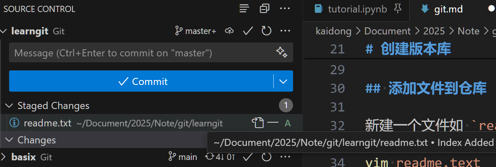
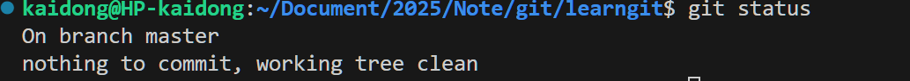
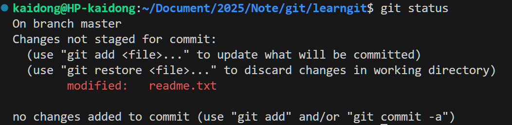
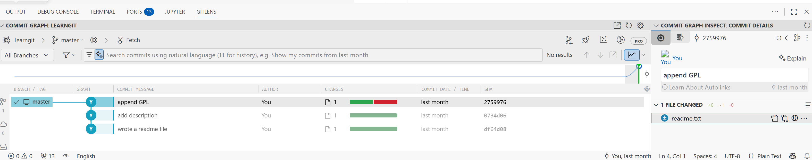
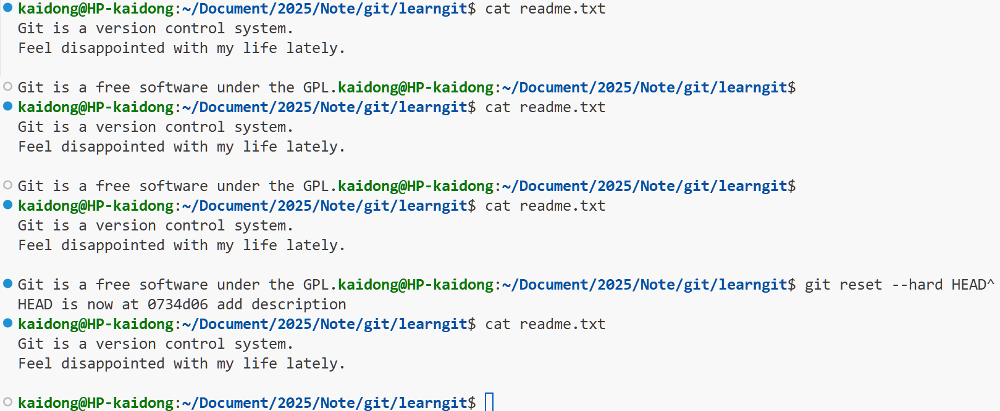
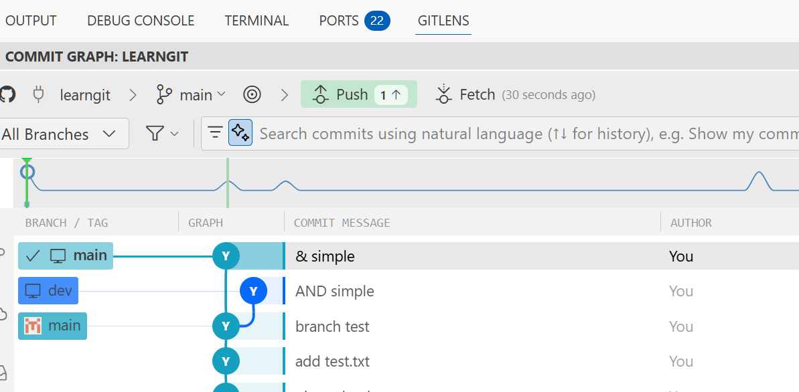
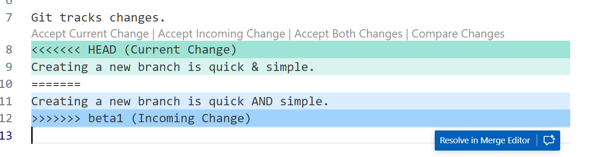
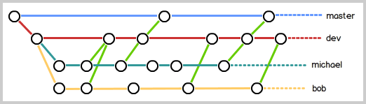

  
  
- [集中式 & 分布式](#集中式--分布式 )
- [配置](#配置 )
- [创建版本库](#创建版本库 )
  - [初始化仓库](#初始化仓库 )
  - [添加文件到仓库](#添加文件到仓库 )
  - [查看当前状态](#查看当前状态 )
  - [查看仓库差异](#查看仓库差异 )
- [版本间切换](#版本间切换 )
  - [1. 查看历史记录](#1-查看历史记录 )
  - [2. 版本回退](#2-版本回退 )
  - [3. 版本前进](#3-版本前进 )
- [结构](#结构 )
  - [示例](#示例 )
    - [1. 提交的流程](#1-提交的流程 )
    - [2. Git 追踪的是修改](#2-git-追踪的是修改 )
    - [3. 撤销修改](#3-撤销修改 )
    - [4. 删除文件](#4-删除文件 )
- [远程仓库](#远程仓库 )
  - [配置 SSH Key](#配置-ssh-key )
    - [1. 生成 SSH Key](#1-生成-ssh-key )
    - [2. 添加到 GitHub](#2-添加到-github )
    - [3. 验证连接](#3-验证连接 )
  - [添加到远程仓库](#添加到远程仓库 )
    - [1. 仓库名称一致性](#1-仓库名称一致性 )
    - [2. 关联远程仓库](#2-关联远程仓库 )
    - [3. 查看远程库信息](#3-查看远程库信息 )
    - [4. 删除与远程仓库的关联](#4-删除与远程仓库的关联 )
  - [从远程仓库克隆到本地](#从远程仓库克隆到本地 )
- [分支管理](#分支管理 )
  - [1. 创建与合并分支](#1-创建与合并分支 )
    - [原理简介](#原理简介 )
    - [实战流程](#实战流程 )
  - [2. 解决冲突](#2-解决冲突 )
  - [3. 分支管理策略](#3-分支管理策略 )
    - [1. 为什么需要 `--no-ff`？](#1-为什么需要--no-ff )
    - [2. 团队协作策略](#2-团队协作策略 )
  - [4. Bug 分支](#4-bug-分支 )
    - [场景](#场景 )
    - [解决方案：`git stash`](#解决方案git-stash )
    - [复制修复 (Cherry-pick)](#复制修复-cherry-pick )
  - [5. Feature 分支](#5-feature-分支 )
    - [场景](#场景-1 )
    - [强制删除](#强制删除 )
  - [6. 多人协作](#6-多人协作 )
    - [1. 推送分支 (Push)](#1-推送分支-push )
    - [2. 抓取分支 (Pull)](#2-抓取分支-pull )
    - [总结：多人协作的工作模式](#总结多人协作的工作模式 )
  - [7. Rebase (变基)](#7-rebase-变基 )
    - [1. 什么是 Rebase？](#1-什么是-rebase )
    - [2. 为什么要用 Rebase？](#2-为什么要用-rebase )
    - [3. 怎么用？](#3-怎么用 )
    - [4. 黄金法则](#4-黄金法则 )
- [标签管理 (Tag)](#标签管理-tag )
    - [1. 什么是标签？](#1-什么是标签 )
    - [2. 创建标签](#2-创建标签 )
    - [3. 查看标签](#3-查看标签 )
    - [4. 操作标签](#4-操作标签 )
  
# 集中式 & 分布式
  
集中式版本控制系统：版本库集中存放在中央服务器。干活的时候用的是自己的电脑，所以在干活前先从中央服务器取得最新的版本，然后干活，干完活了，再把自己所做的推送到中央服务器。这样一个直接的问题就是必须联网才能工作，并且在网速慢的时候提交文件的效率也很低。
  
分布式版本控制系统：安全性更高，因为每个人电脑里都有一个完整的版本控制系统。另外也不需要联网，大家各自在自己的电脑上进行修改，最后互相推送修改。当然在分布式版本控制系统里面也有一个充当“中央服务器”的角色，因为有可能你和同事不在一个局域网内，两台电脑互相访问不了，也可能今天你同事的电脑压根没有开机。这个服务器的作用仅仅是用来方便“交换”大家的修改，没有它大家也一样干活，只是交换修改不方便而已。
  
# 配置
  
安装好 `git` 后需要配置以表明你的机器的名字、地址
  
```bash
$ git config --global user.name "Your Name"
$ git config --global user.email "email@example.com"
```
  
这里的 `--global` 表明是全局的设置，也就是你这台机器上（应该是你这个用户）所有的Git仓库都会使用这个配置，一般会生成文件 `/.gitconfig`。
**注意这个邮箱最好跟你使用的代码托管平台 github/gitee 的注册邮箱一致，因为后续上传到托管平台的时候会根据邮箱来匹配账户**
  
如果使用 `--local`，配置只会对当前所在的 Git 仓库有效，比如对于某个项目，可以使用其他的用户名、邮箱，这个时候的配置信息就放在当前目录下面的 `.git/config` 里面
  
# 创建版本库
  
## 初始化仓库
  
创建一个文件夹，然后进去后在当前目录下使用 `git init` 就把这个目录变成Git可以管理的仓库。有个隐藏文件夹 `.git` 下面可以查看当前 local 的配置等
> vscode 默认不会显示 `.git` 文件夹。需要在设置（`ctrl+,`），`Files:exclude` 下面设置一下。
  
所有的版本控制系统，其实只能跟踪文本文件的改动，比如TXT文件，网页，所有的程序代码等等，Git也不例外。版本控制系统可以告诉你每次的改动，比如在第5行加了一个单词“Linux”，在第8行删了一个单词“Windows”。而图片、视频这些二进制文件，虽然也能由版本控制系统管理，但没法跟踪文件的变化，只能把二进制文件每次改动串起来，也就是只知道图片从100KB改成了120KB，但到底改了啥，版本控制系统不知道，也没法知道。
  
## 添加文件到仓库
  
新建一个文件如 `readme.txt`
```bash
vim readme.text
[i]
Git is a version control system.
Feel disappointed with my life lately.
[esc]
[:wq]
```
其实建好文件后， vscode 已经会在左侧提醒你这个文件当前状态 `Untracked`，未跟踪，也就是这个文件仅仅只在这个文件夹里面，还没有加入到仓库中
  
1. 将文件添加到仓库（的暂存区）
```bash
$ git add readme.txt
```
此时左侧会显示当前状态 `Staged`，也就是暂存，位于暂存区。如果有多个文件，就继续使用 `git add `

  
2. 将文件提交到仓库。`-m` 后面输入的是本次提交的说明，最好是有意义的便于从历史记录中找到改动。
```bash
$ git commit -m "wrote a readme file"
[master (root-commit) eaadf4e] wrote a readme file
 1 file changed, 2 insertions(+)
 create mode 100644 readme.txt
```
  
## 查看当前状态
  
使用 `git status` 查看当前仓库状态

如果对 readme.txt 进行修改，添加一句 `Git is a free software.` 这时候 vscode 自己会出现变色的提示 `modified`。这时候再查看仓库状态

  
1. 首先它说明是哪个分支
2. `Changes not staged for commit:` 表明有_没有暂存的修改，也就是没有添加到暂存区。以及修改的文件是哪个。
3. `no changes added to commit` 表明没有_没有提交的修改。因为刚才的修改都还没添加到暂存区，所以暂存区内现在没有准备提交的修改。
  
## 查看仓库差异
  
如果我们过了好几天记不清到底修改了什么东西，就需要查看具体的差异是什么，添加的空白行也显示在那
  
```bash
$ git diff
diff --git a/readme.txt b/readme.txt
index 235463e..1bebcf6 100644
--- a/readme.txt
+++ b/readme.txt
@@ -1,2 +1,4 @@
 Git is a version control system.
 Feel disappointed with my life lately.
+
+Git is a free software.
\ No newline at end of file
```
  
好了，把刚才修改了的文件添加到暂存区，再查看状态。这时候显示的就是有_没有提交的修改
```bash
$ git add readme.txt 
$ git status 
On branch master
Changes to be committed:
  (use "git restore --staged <file>..." to unstage)
        modified:   readme.txt
```
  
# 版本间切换
  
再对文件进行修改成下面这样，然后添加到暂存区，然后提交 
```text
Git is a version control system.
Feel disappointed with my life lately.
  
Git is a free software under the GPL.
```
  
```bash
$ git add readme.txt 
$ git commit -m "append GPL"
[master 2759976] append GPL
 1 file changed, 1 insertion(+), 1 deletion(-)
```
  
## 1. 查看历史记录
  
当然在实际工作中，我们脑子里怎么可能记得一个几千行的文件每次都改了什么内容，不然要版本控制系统干什么。通过 `git log` 查看历史记录
```bash
$ git log
commit 27599769ed0f996a1ab381643bd24ffd55b899c1 (HEAD -> master)
Author: Your Name <youremail@example.com>
Date:   Wed Aug 20 14:52:54 2025 +0800
  
    append GPL
  
commit 0734d0620b3fd08d0214c84daa80b654733d48b8
Author: Your Name <youremail@example.com>
Date:   Wed Aug 20 14:50:47 2025 +0800
  
    add description
  
commit df64d08e4697a84838d303116697b9c80ca551d8
Author: Your Name <youremail@example.com>
Date:   Wed Aug 20 14:28:57 2025 +0800
  
    wrote a readme file
```
  
1. 日志的信息是从最近到最远的提交。如果嫌输出信息太多，看得眼花缭乱的，可以加上 `--pretty=oneline`
2. commit 后面跟着的是一个用十六进制表示的一个很大的数字，代表版本号 `commit id`，不同机器上的也不一样。之所以要用很大的一个数字，因为如果大家都用 1，2，3，，，多人在同一个仓库工作的话就会冲突
  
通过一些可视化的插件可以看得更清晰

  
## 2. 版本回退
  
在 Git 中，用 `HEAD` 表示当前版本，也就是对应的 ID 为 27599769... 那个 （当我们需要用到这个 ID 的时候不用完整的输入，只要够区分就行）。上一个版本就是 `HEAD^`，上上个版本 `HEAD^^`，往上 100 个版本就是 `HEAD~100`。比如我们想把当前版本回退到上一个版本
```bash
git reset --hard HEAD^
```
这里的参数 `--hard` 是回退到上个版本的已提交状态；`--soft` 是回退到上个版本的未提交状态；`--mixed` 是回退到上个版本已添加但未提交的状态。

  
## 3. 版本前进
  
此时使用 `git log` 会发现最新版本的记录已经没了。好了，:joy:那现在想回到最新的那个版本怎么办，一个做法就是如果你还记得或者还能找到那个版本的 `commit ID`，那么就直接 `git reset --hard 27599`
  
Git 通过命令 `git reflog` 可以查看每一次操作的记录，进而可以查看版本的 ID
  
# 结构
  
1. 工作区(Working Directory) : 在电脑里面看到的目录.
2. 版本库(Repository) : 在工作区里面有一个隐藏文件夹 `.git`. 这里面包含很多版本控制相关的东西,最重要的是两个
    1. 暂存区(stage 或 index)
    2. 分支(branch) : Git 自动创建了第一个分支 `master`,以及指向第一个分支的指针 `HEAD`
  
我们把文件往版本库添加的时候主要就是分两步进行, 第一步用 `git add` 把文件添加到暂存区,第二步是用 `git commit` 提交更改,也就是把暂存区的内容再提到到当前 (`HEAD` 对应的)的分支
  
## 示例
  
### 1. 提交的流程
  
比如我再对 `readme.txt` 文件进行了修改,并新添加了一个文件 `LICENSE`,此时查看当前状态
```bash
user@hostname:~/Document/2025/Note/git/learngit$ git status
On branch master
Changes not staged for commit:
  (use "git add <file>..." to update what will be committed)
  (use "git restore <file>..." to discard changes in working directory)
        modified:   readme.txt
  
Untracked files:
  (use "git add <file>..." to include in what will be committed)
        LICENSE
  
no changes added to commit (use "git add" and/or "git commit -a")
```
将他们添加到暂存区后,
```bash
user@hostname:~/Document/2025/Note/git/learngit$ git status 
On branch master
Changes to be committed:
  (use "git restore --staged <file>..." to unstage)
        new file:   LICENSE
        modified:   readme.txt
```
然后 `commit`
```bash
user@hostname:~/Document/2025/Note/git/learngit$ git commit -m "understand how stage works"
[master 0327a15] understand how stage works
 2 files changed, 3 insertions(+), 1 deletion(-)
 create mode 100644 LICENSE
user@hostname:~/Document/2025/Note/git/learngit$ git status
On branch master
nothing to commit, working tree clean
```
  
### 2. Git 追踪的是修改
  
首先在 `readme.txt` 里面新添 `Git tracks changes.`,然后 `add`. 然后再修改 `Git tracks changes of files.`. 此时提交,会发现新修改的那个根本没有被提交,因为它都没有进入暂存区!
  
查看版本库里最新版本和工作区的差别 `git diff HEAD -- readme.txt`
  
### 3. 撤销修改
  
1. 工作区
刚才我们不是把 `Git tracks changes.` 改成了 `Git tracks changes of files.`, 还没有添加.怎么撤销这个修改呢,第一个方法就是直接在这个文件里面该回去,此时用 `git status` 查看会发现 working tree 变干净了.但是更实用的第二个方法是, `git restore <file>` 撤销掉工作区还未添加的这个修改
> 使用 `git status` 的时候,Git 也会提示你这个做法
> ```bash
> user@hostname:~/Document/2025/Note/git/learngit$ git status
> On branch master
> Changes not staged for commit:
>  (use "git add <file>..." to update what will be committed)
>  (use "git restore <file>..." to discard changes in working directory)
>        modified:   readme.txt
> no changes added to commit (use "git add" and/or "git commit -a")
> ```
  
2. 暂存区
如果修改已经被添加到暂存区了呢.一样地,`restore` 撤销掉,可以看到现在暂存区是干净的,那个修改退回到工作区了
```bash
user@hostname:~/Document/2025/Note/git/learngit$ git add readme.txt 
user@hostname:~/Document/2025/Note/git/learngit$ git status 
On branch master
Changes to be committed:
  (use "git restore --staged <file>..." to unstage)
        modified:   readme.txt
  
user@hostname:~/Document/2025/Note/git/learngit$ git restore --staged readme.txt 
user@hostname:~/Document/2025/Note/git/learngit$ git status 
On branch master
Changes not staged for commit:
  (use "git add <file>..." to update what will be committed)
  (use "git restore <file>..." to discard changes in working directory)
        modified:   readme.txt
  
no changes added to commit (use "git add" and/or "git commit -a")
```
  
3. 版本回退
如果不仅添加,并且还提交了这个修改,那么此时我们想取消这个修改的话就需要版本回退了,见前面.
  
### 4. 删除文件
  
首先再次强调,整个结构分为两块,工作区和版本库(Repository),版本库包括一个暂存区(stage) 和分支.
  
如果想删除某个文件,
情况1: 这个文件只是工作区的,还没有添加到版本库,那么直接删除就行了,不会影响版本库
情况2: 这个文件已经添加到版本库了但是还没有提交,此时 `git status` 会显示待提交,使用 `git ls-files` 可以看到这个文件在暂存区.此时按照提示直接 `git restore --staged <file>` 就回到情况 1; 此时也可以在工作区删除 `rm`,然后把这个操作添加到暂存区,也就是 `git add <file>` 就会把这个文件从工作区以及暂存区删除
> 如果此时误删也可以用 `git restore --staged <file>` 先恢复到暂存区,然后再用 `git restore <file>` 恢复工作区的文件
  
# 远程仓库
  
## 配置 SSH Key
  
Git 支持 HTTPS 和 SSH 两种协议连接远程仓库。推荐使用 SSH，因为速度快且不需要每次输入密码。
  
SSH 连接的原理是非对称加密：
*   `id_rsa` (私钥)：保存在你本地，相当于你的身份证，**绝对不能泄露**。
*   `id_rsa.pub` (公钥)：上传到 GitHub，相当于你留在那里的锁。
    *   GitHub 用你的公钥加密一段信息发给你。
    *   你用私钥解密并发回。
    *   GitHub 验证正确，允许连接。
  
### 1. 生成 SSH Key
  
如果你想重新生成，或者第一次配置：
  
1.  (可选) 删除旧的 Key：
    ```bash
    rm -rf ~/.ssh/id_rsa ~/.ssh/id_rsa.pub ~/.ssh/id_ed25519 ~/.ssh/id_ed25519.pub
    ```
    > 注意：如果这对密钥还用于连接公司服务器或其他云平台，删除会导致那些服务无法连接。如果是个人电脑且只用于 GitHub，通常没问题。
  
    **ed_25519 是指更安全的密钥类型**
  
2.  生成新的 Key：
    ```bash
    ssh-keygen -t ed25519 -C "你的邮箱@example.com"    
    ```
    一路回车即可（也可以设置密码，但每次 push 都要输密码）。
  
### 2. 添加到 GitHub
  
1.  查看公钥内容：
    ```bash
    cat ~/.ssh/id_rsa.pub
    ```
2.  复制输出的内容（以 `ssh-rsa` 开头）。
3.  登录 GitHub -> Settings -> SSH and GPG keys -> New SSH key。
4.  Title 随便填（比如 "My Laptop"），Key 粘贴刚才复制的内容。
  
### 3. 验证连接
  
```bash
ssh -T git@github.com
```
如果看到 `Hi username! You've successfully authenticated...` 就说明成功了。
  
> 我在本地 Windows 做了这些操作后,如果要在 WSL　里使用还得做一次配置　（或者也可以把密钥复制过来？
  
## 添加到远程仓库
  
### 1. 仓库名称一致性
  
**本地仓库和远程仓库的名字不需要一样。**
  
*   **本地仓库名**：就是你文件夹的名字（比如 `learngit`）。
*   **远程仓库名**：是你在 GitHub 上创建仓库时起的名字（比如 `git-study-notes`）。
  
它们之间是通过 Git 配置文件里的 URL 关联的，名字不同完全不影响使用。不过为了方便管理，通常建议保持一致。
  
### 2. 关联远程仓库
  
假设你在 GitHub 上已经新建了一个空仓库，现在要把本地的 `learngit` 仓库关联上去。
  
1.  **添加远程仓库地址**：
    ```bash
    git remote add origin git@github.com:你的用户名/远程仓库名.git
    ```
    *   `origin`：这是 Git 对远程仓库的默认叫法（惯例），你也可以叫 `github` 或 `remote1`，但 `origin` 最通用。(相当于远程仓库的别名，方便记忆和操作,免得输入一大串地址)
    *   后面那串地址：在 GitHub 仓库页面的 "Code" -> "SSH" 选项卡里复制。
  
2.  **推送到远程**：
    ```bash
    git push -u origin master
    ```
    *   `-u` 参数：第一次推送的时候使用，还会把本地的 `master` 分支和远程的 `master` 分支关联起来（Set Upstream）。以后再推送时，只需要输入 `git push` 就可以了。
    *   注意：GitHub 现在新建仓库默认分支名在 2020 年后是 `main`。如果你的本地是 `master` 而远程是 `main`，你可能需要先重命名本地分支：`git branch -M main`。
  
> 一开始也可以通过 `git config --global init.defaultBranch main` 设置默认分支名为 `main`, 这样新建仓库时默认分支就是 `main` 了。
  
### 3. 查看远程库信息
  
```bash
git remote -v
```
这会显示你当前关联的远程仓库的抓取（fetch）和推送（push）地址。
  
### 4. 删除与远程仓库的关联
通过 `git remote remove origin` 可以删除与远程仓库的关联。
  
## 从远程仓库克隆到本地
  
通过 `git clone` 可以从远程仓库克隆到本地,如果想换个本地仓库的名字,可以 `git clone <url> <你想要的文件夹名>`
  
# 分支管理
  
## 1. 创建与合并分支
  
### 原理简介
Git 的分支本质上仅仅是指向提交对象的可变指针。
*   **HEAD**：指向当前分支。
*   **Main**：Github 的默认主分支。
  
创建分支就是新建一个指针；切换分支就是移动 HEAD 指针；合并分支（Fast-forward）就是直接移动指针，速度极快。
  
  
### 实战流程
  
1.  **创建并切换到 `dev` 分支**：
    ```bash
    git switch -c dev
    ```
    此时 HEAD 指向 `dev`。
  
2.  **修改文件并提交**：
    修改 `readme.txt`，然后：
    ```bash
    git add readme.txt
    git commit -m "new branch test"
    ```
    此时 `dev` 指针向前移动，而 `master` 指针原地不动。
  
3.  **切回 `master` 分支**：
    ```bash
    git switch master
    ```
    此时查看文件，刚才的修改消失了（因为 HEAD 回到了 `master`）。
  
4.  **合并分支**：
    把 `dev` 的成果合并到 `master`：
    ```bash
    git merge dev
    ```
    输出 `Fast-forward` 表示这次合并是“快进模式”，直接把 `master` 指针移到了 `dev` 的位置。
  
5.  **删除 `dev` 分支**：
    ```bash
    git branch -d dev
    ```
  
**一般都是开发的时候新建一个分支出来测试，正常的话再 merge 回去**
  
## 2. 解决冲突
新建一个分支修改 `readme.txt` 最后一行为 `Creating a new branch is quick AND simple.` ，添加，提交。然后切回主分支，修改 `readme.txt` 最后一行为 `Creating a new branch is quick & simple.`，添加，提交。
  
此时的状态

这种情况下，Git无法执行“快速合并”，会出现冲突
```bash
$ git merge dev
Auto-merging readme.txt
CONFLICT (content): Merge conflict in readme.txt
Automatic merge failed; fix conflicts and then commit the result.
```
此时文件 `readme.txt` 显示如下
  

  
要做的就是手动修改，“告诉它应该怎样合并”，比如把整个那部分改成 `Creating a new branch is quick and simple.`然后再 add, commit 就可以了 
  
> ==注意==，当执行了 `merge` 后即使有冲突此时也是在这个过程中 in progress，所以手动修改那一行就是告诉它怎样合并，修改完这个 merge 就结束了。并不是说我们在修改其中一条分支然后还要 merge。又或者说，merge 后遇到了冲突，此时如果想退出当前这个未执行完的步骤，可以 `git merge --abort`
  
## 3. 分支管理策略
  
### 1. 为什么需要 `--no-ff`？
  
通常合并分支时，Git 会默认使用 `Fast forward` 模式，也就是直接把 `main` 指针移到 `dev` 的最新提交上。
> 如果是想刚才有冲突的那种，会自动生成 merge commit，也就是已经留痕了。
  
*   **优点**：快。
*   **缺点**：合并后，看不出曾经做过合并。如果删除了 `dev` 分支，就彻底丢掉了“这几个提交是属于同一个功能开发”的上下文信息。
  
如果我们加上 `--no-ff` 参数（禁用 Fast forward）：
```bash
git merge --no-ff -m "merge with no-ff" dev
```
Git 会在 merge 时生成一个新的 commit。这样，从分支历史上就可以清楚地看到“这里发生了一次合并”。
  
**对比**：
*   **Fast forward**: 历史是一条直线，看不出分支开发的过程。
*   **--no-ff**: 历史有分叉和汇合，能看出哪些提交是作为一个整体（Feature）被合并进来的。即便之后把那个分支删了也能看到
  
### 2. 团队协作策略
  
在实际开发中，我们应该按照以下原则管理分支：
  
1.  **`main`**：
    *   **最稳定**。
    *   仅用于发布新版本。
    *   平时**不要**直接在上面干活。
  
2.  **`dev`**：
    *   **干活的地方**。
    *   是不稳定的。
    *   所有团队成员都向这个分支合并代码。
    *   当版本开发完成并测试通过后，再合并到 `main` 发布。
  
3.  **个人分支 / Feature 分支**：
    *   每个人在自己的分支上开发，开发完合并到 `dev`。
  

**(图示：master 是主干，dev 是平行干线，个人分支是 dev 的小分叉)**
  
## 4. Bug 分支
  
### 场景
当你正在 `dev` 分支上进行开发（比如写到一半，还没法提交），突然接到一个紧急 Bug 修复任务（比如 `main` 分支上有个 404 错误）。
  
:apple: 由于所有已添加但未提交的修改，对于所有分支都是可见的，并且这些修改最终会被某次提交所独占。因此如果在 `dev` 的任务没做完没有提交，切换到 `bug` 分支，那么之前在 `dev` 的那些未完成的工作现在也能看到，提交 bug 分支也会将这些未完成的工作也一并提交上去；并且这些未完成的工作也会被这个 `bug` 分支的这次提交所独占，当你再切回原来的环境 `dev` 时，原先未完成的工作已经不可见了
> 也就是暂存区是对所有分支都适用的。另外如果一个文件都还没有添加到暂存区那么按理说不会影响，只要后续别 add 这个文件。不过为了方便干净，最好在要跳出去修 bug 的时候还是把当前的任务（即使没完成）也添加到暂存区，然后 stash 后看着更干净。
  
### 解决方案：`git stash`
  
1.  **保存现场**：
    把当前工作区“储藏”起来，让工作区变干净。
    ```bash
    git stash
    ```
    此时 `git status` 是干净的。
  
2.  **修复 Bug**：
    *   切换到出 Bug 的分支（比如 `main`）：`git switch main`
    *   创建临时 Bug 分支：`git switch -c issue-101`
    *   修复代码，提交：`git commit -m "fix bug 101"`
    *   切回 `main`，合并并删除 Bug 分支：
        ```bash
        git switch main
        git merge --no-ff -m "merged bug fix 101" issue-101
        git branch -d issue-101
        ```
  
3.  **恢复现场**：
    *   切回你原本干活的分支：`git switch dev`
    *   查看储藏列表：`git stash list`
    *   恢复并删除储藏：
        ```bash
        git stash pop
        ```
        *(或者分两步：`git stash apply` 恢复，`git stash drop` 删除)*
  
> git stash push -m "备注" [文件]
  
### 复制修复 (Cherry-pick)
你在 `main` 上修好了 Bug，但同样的 Bug 在 `dev` 分支上也存在（因为 `dev` 是从 `main` 分出来的）。
不需要在 `dev` 上重新改一遍代码，只需要把刚才修复 Bug 的那个 **Commit** “复制”过来。
  
```bash
git cherry-pick <commit-id>
```
Git 会自动把那个提交所做的修改应用到当前分支。
  
==注意，如果先恢复储藏再 cherry-pick 可能会有冲突。所以顺序先 cherry-pick 再 stash pop==
  
## 5. Feature 分支
  
### 场景
开发一个新功能（Feature），最好新建一个分支。
比如开发代号为 `vulcan` 的新功能。
  
```bash
git switch -c feature-vulcan
# ... 开发 ... 提交 ...
```
  
### 强制删除
如果这个功能开发到一半，或者开发完还没合并，上级突然说“这个功能取消了，不要了”。
此时如果直接删除分支 `git branch -d feature-vulcan`，Git 会阻止你，因为它怕你丢失未合并的成果。
  
必须使用 **大写 -D** 强制删除：
```bash
git branch -D feature-vulcan
```
  
## 6. 多人协作
  
### 1. 推送分支 (Push)
当你从远程仓库克隆时，Git 自动把本地的 `main` 分支和远程的 `main` 分支对应起来了，远程仓库默认名称是 `origin`。
  
*   **查看远程库信息**：`git remote -v`
*   **推送分支**：
    ```bash
    git push origin main  # 推送主分支
    git push origin dev     # 推送开发分支
    ```
    *   并不是所有分支都要推送。`main` 和 `dev` 通常需要同步，而个人的 `bug` 分支或 `feature` 分支如果不需要别人参与，可以只保留在本地。
  
### 2. 抓取分支 (Pull)
多人协作时，大家都会往 `master` 或 `dev` 上推送。
  
**场景**：
1.  你的同事小王在 `dev` 分支上推送了 `hello.py` 的修改。
2.  你也修改了 `hello.py`，并试图推送 `git push origin dev`。
3.  **报错**：推送失败，因为你的提交和小王的提交冲突了（你的进度落后了）。
  
```
git push origin dev
To github.com:phyzk/learngit.git
 ! [rejected]        dev -> dev (non-fast-forward)
error: failed to push some refs to 'github.com:phyzk/learngit.git'
hint: Updates were rejected because the tip of your current branch is behind
hint: its remote counterpart. If you want to integrate the remote changes,
hint: use 'git pull' before pushing again.
hint: See the 'Note about fast-forwards' in 'git push --help' for details.
```
  
**解决步骤**：
1.  **先抓取**：把最新的提交从远程抓下来。
    ```bash
    git pull
    ```
    > 如果提示 `no tracking information`，说明你的本地分支 `dev` 和远程分支 `origin/dev` 没建立关联。
    > 使用命令：`git branch --set-upstream-to=origin/dev dev`
  
2.  **解冲突**：`git pull` 下来后，如果文件有冲突，手动解决冲突（和合并分支时的操作一样）。此时会提示你选择哪种策略
    - merge: git pull origin dev --no-rebase 把远程的修改和你的修改合并，生成一个新的 Merge Commit。
    - rebase: git pull origin dev --no-rebase 把你的修改“搬运”到远程修改的后面。
3.  **再提交**：解决完冲突后，`add` -> `commit`。
4.  **再推送**：`git push origin dev`。
  
### 总结：多人协作的工作模式
1.  试图推送：`git push origin <branch-name>`
2.  如果失败（远程比你新）：`git pull` 试图合并。
3.  如果合并有冲突：解决冲突，并在本地提交。
4.  没有冲突或解决后：再次 `git push origin <branch-name>`。
  
> `git pull <远程主机名> <远程分支名>:<本地分支名>` 
> `git push <远程主机名> <本地分支名>:<远程分支名>` 通常 : 后面的不加，默认相同名字的分支，一般也不会出现把本地 dev push 到远程 main 这种情况
  
:car: 此时使用 status 会发现显示
```bash
Your branch and 'origin/main' have diverged,
and have 3 and 3 different commits each, respectively.
```
因为现在我们本地在 dev 分支，git 比较却比较的是远程的 main，也就是 origin/main 。需要修正一下本地和远程之间的追踪关系
```
git branch --set-upstream-to=origin/dev dev
```
  
  
## 7. Rebase (变基)
  
### 1. 什么是 Rebase？
`rebase` 和 `merge` 都是用来合并分支的，但效果不同。
*   **Merge**：会生成一个新的“合并提交”，历史记录会有分叉和汇合，像编织的网。
*   **Rebase**：把你的提交“搬运”到目标分支的最新提交后面，历史记录是一条直线。
  
### 2. 为什么要用 Rebase？
为了让提交历史看起来**整洁、线性**。
强迫症患者（和很多开源项目维护者）不喜欢看到乱七八糟的分叉，希望历史记录像一条直线一样清晰。
  
### 3. 怎么用？
假设你在 `dev` 分支上开发，`master` 分支有了新提交。
如果你直接 `merge master`，会产生分叉。
如果你用 `rebase`：
  
```bash
git switch dev
git rebase master
```
**原理**：
1.  Git 把你 `dev` 分支上的修改暂时“存”起来。
2.  把 `dev` 指针指向 `master` 的最新位置。
3.  把你刚才存起来的修改，一个一个地应用（Apply）上去。
  
### 4. 黄金法则
**不要对已经推送到远程的分支执行 Rebase！**
  
因为 Rebase 会**修改历史**（改变 Commit ID）。如果你修改了别人已经下载过的历史，会给团队带来巨大的灾难。
**只在自己本地的、还没推送到远程的私人分支上使用 Rebase 来整理历史。**
  
# 标签管理 (Tag)
  
### 1. 什么是标签？
Git 的标签（Tag）就是给某个 Commit ID 挂一个好记的名字，比如 `v1.0`。
*   **Commit ID**: `6a5819e...` (难记)
*   **Tag**: `v1.0` (好记)
  
### 2. 创建标签
  
*   **打在最新提交上**：
    ```bash
    git tag v1.0
    ```
*   **打在历史提交上**：
    先用 `git log` 找到 commit id，比如 `6224937`。
    ```bash
    git tag v0.9 6224937
    ```
*   **创建带有说明的标签** (`-a` 指定标签名，`-m` 指定说明)：
    ```bash
    git tag -a v0.1 -m "version 0.1 released" 3628164
    ```
  
### 3. 查看标签
  
*   **列出所有标签**：
    ```bash
    git tag
    ```
*   **查看标签信息**：
    ```bash
    git show v0.9
    ```
  
### 4. 操作标签
  
*   **删除本地标签**：
    ```bash
    git tag -d v0.1
    ```
  
*   **推送标签到远程**：
    *   推送某个标签：
        ```bash
        git push origin v1.0
        ```
    *   一次性推送全部未推送的标签：
        ```bash
        git push origin --tags
        ```
  
*   **删除远程标签**：
    如果标签已经推送到远程，删除稍微麻烦点，分两步：
    1.  先删除本地：
        ```bash
        git tag -d v0.9
        ```
    2.  再删除远程：
        ```bash
        git push origin :refs/tags/v0.9
        ```
        **这句话的意思其实就是用空的标签推送到远程，从而达到删除远程标签的目的**。这里冒号的使用跟前面 `git push` 那里一样，对于 git push，冒号前是本地，冒号后是远程；对于 git pull，冒号前是远程，冒号后是本地
  